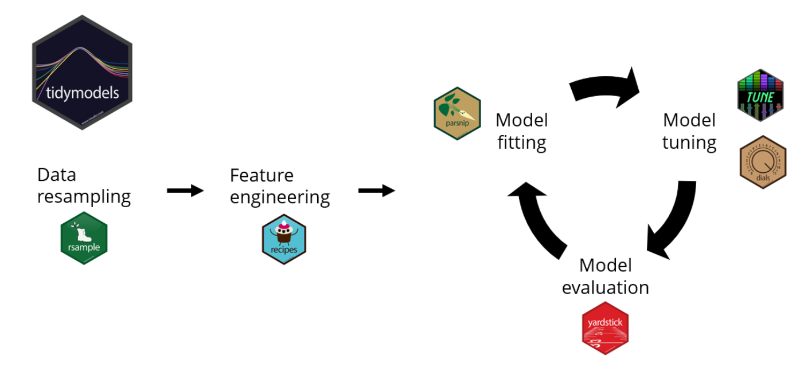
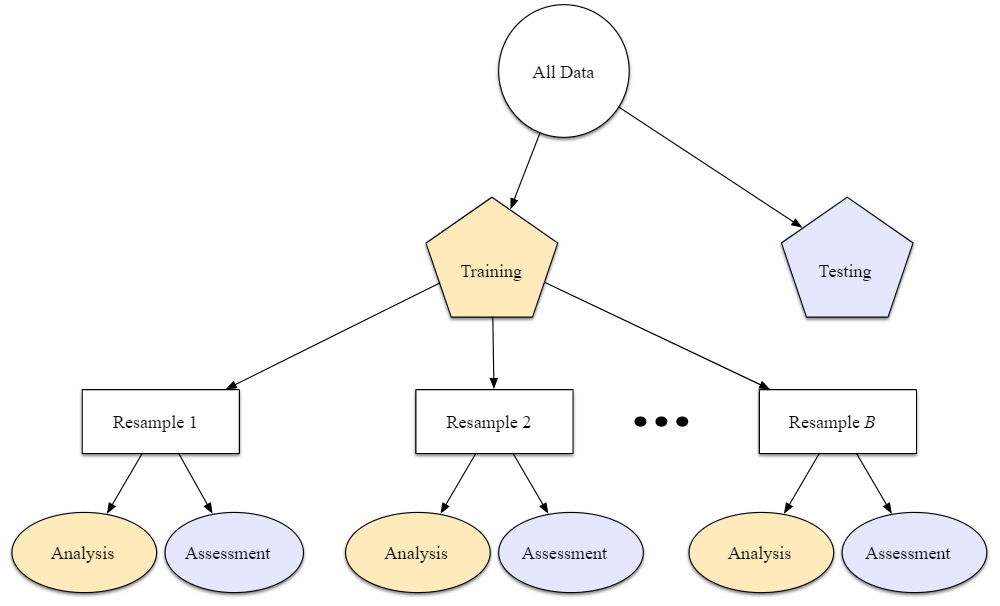
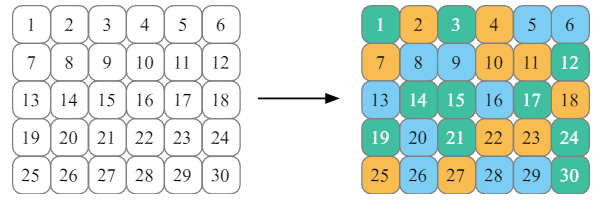
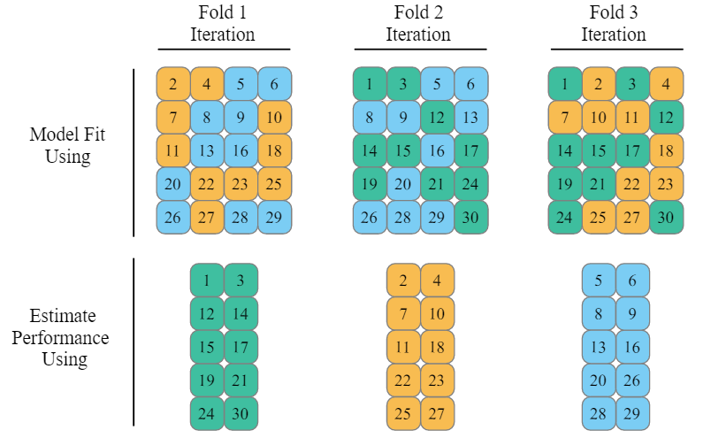
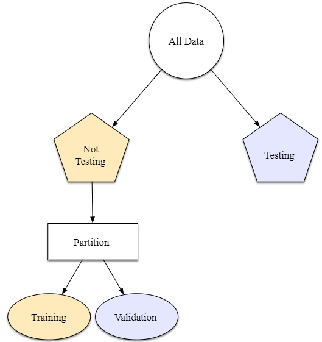
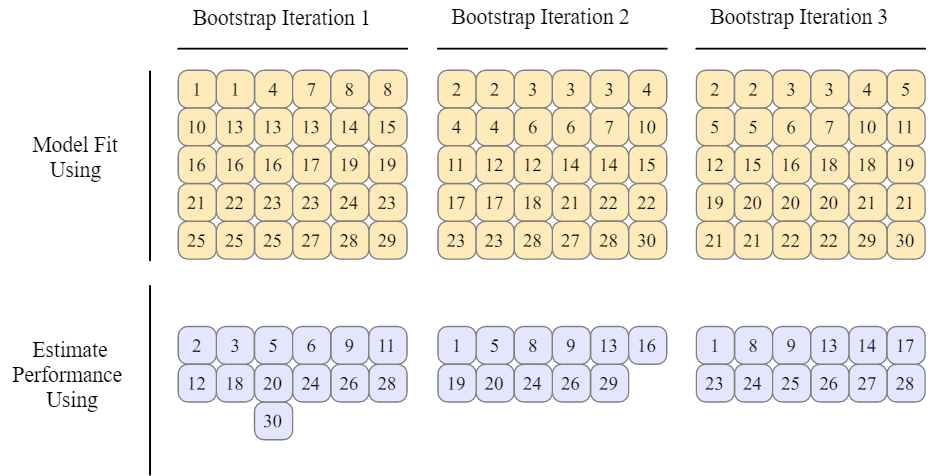

# Tidymodels

# Data Resampling:
Simple Random Resampling: is appropriate in many cases.
- when there is severe class imbalance

## Resampling

### Cross-Validation

 Data is randomly partitioned into V sets of roughly equal size (called the “folds”).

#### Repeated
_One way to reduce noise is to gather more data. For cross-validation, this means averaging more than V statistics._

#### Leave-One-Out

#### Monte Carlo
_Allocates a fixed proportion of data to the assessment set. The difference is that, for MCCV, this proportion of the data is randomly selected each time. This results in assessment sets that are not mutually exclusive. To create these resampling objects:_

### Validation Set

_single partition that is set aside to estimate performance, before using the test set_

### Bootstraping

_Was originally invented as a method for approximating the sampling distribution of statistics whose theoretical properties are intractable. A bootstrap sample of the training set is a sample that is the same size as the training set but is drawn with replacement. This means that some training set data points are selected multiple times for the analysis set. Each data point has a 63.2% chance of inclusion in the training set at least once. The assessment set contains all of the training set samples that were not selected for the analysis set (on average, with 36.8% of the training set). When bootstrapping, the assessment set is often called the “out-of-bag” sample._

#### Functions
**(rsample)**

Function | Description | Parameters
--- | --- | ---
initial_split() | creates a single binary split of the data into a training set and testing set | data, prop, strata, breaks, lag
training() | takes the 1st prop of samples from _initial_split()_ |
testing() | takes the 2st prop of samples from _initial_split()_ |
vfold_cv() | randomly splits the data into V groups of roughly equal size (called "folds") | data, v, repeats, strata, breaks
mc_cv() | One resample of Monte Carlo cross-validation takes a random sample (without replacement) of the original data set to be used for analysis. All other data points are added to the assessment set. | data, prop, times, strata, breaks
validation_split() | takes a single random sample (without replacement) of the original data set to be used for analysis. All other data points are added to the assessment set (to be used as the validation set) | data, prop, strata, breaks
bootstraps() | A bootstrap sample is a sample that is the same size as the original data set that is made using replacement | data, times, strata, breaks

# Feature Engineering
- Correlation between predictors
- missing values
- Distribution
- Center and Scale
- Feature Extraction

#### Functions

Function | Description | Parameters
--- | --- | ---
recipe() | A recipe is a description of what steps should be applied to a data set in order to get it ready for data analysis | formula, data
prep() | Train a Data Recipe | x, training, verbose, retain
bake() | Apply a Trained Data Recipe | object, new_data
step_log() | creates a specification of a recipe step that will log transform data | recipe, base, columns
step_dummy() | dummy variable creation | recipe, one_hot, naming
step_normalize | Center and Scale numeric data | recipe
step_YeoJohnson | Yeo-Johnson Transformation | recipe, lambdas
step_unknown() | Assign missing categories to "unknown" | recipe, new_level
step_other() | creates a specification of a recipe step that will potentially pool infrequently occurring values into an "other" category | recipe, threshold
step_interact() | creates interaction variables | recipe, terms
step_filter() | creates a specification of a recipe step that will remove rows using dplyr::filter(). | recipe, inputs
step_downsample() | Down-Sample a Data Set Based on a Factor Variable | recipe, under_ratio, target, skip
step_upsample() | Up-Sample a Data Set Based on a Factor Variable | recipe, over_ratio, target, skip

# Model Fitting

## Grid Search
**Regular Grid**: each parameter has a corresponding set of possible values
**Non-Regular Grid**: parameter combinations are not formed from a small set of points.
- **_Latin Hypercube_**
  + In the context of statistical sampling, a square grid containing sample positions is a Latin Square if and only if there is one sample in each row and each column
  + A Latin Hypercube is the generalization of this concept to an arbitrary number of dimensions, whereby each sample is the only one in each axis-aligned hyperplane containing it. 
  + **Method**
    + Stratification of the input probability distribution
    + Stratification divides the cumulative curve into equal intervals
    + A sample is then randomly taken from each interval or "stratification"
  + Recreate the input distribution through less samples
  + Allows the creation of experimental designs with as many points as needed or desired
  + For computer experiments, an attractive sampling technique would have to be flexible enough to provide data a) for modeling techniques based on very different statistical assumptions and b) capable of covering small and large design spaces
  + If few dimensions have to be dropped out, the resulting design is still a Latin Hypercube because samples are non-collasping

## Iterative Search
**Bayesian Optimization**: analyze the current resampling results and create a predictive model to suggest tuning parameter values that have yet to be evaluated. The suggested parameter combination is then resampled. These results are then used in another predictive model that recommends more candidate values for testing, and so on. The process proceeds for a set number of iterations or until no further improvements occur.

**Simulated Annealing**: A general nonlinear search routine inspired by the process in which metal cools. It is a global search method that can effectively navigate many different types of search landscapes, including discontinuous functions. Unlike most gradient-based optimization routines, simulated annealing can reassess previous solutions.

#### Functions:
**(tune)**

Function | Description | Parameters
--- | --- | ---
parameters() | Determination of parameter sets for other objects |
fit_resamples() | computes a set of performance metrics across one or more resamples. It does not perform any tuning, and is instead used for fitting a single model+recipe or model+formula combination across many resamples | object _(model spec of workflow)_, resamples, metrics, control
tune_grid() | computes a set of performance metrics (e.g. accuracy or RMSE) for a pre-defined set of tuning parameters that correspond to a model or recipe across one or more resamples of the data | object, resamples, param_info, grid, metrics, control
tune_bayes() | Bayesian optimization of model parameters | object, iter, initial, objective, param_info, control
control_resamples() / control_grid() | Control aspects of the Grid Search process | verbose, allow_par, extract, save_pred, save_workflow, event_level, parallel_over("resamples","everything")   
tune_sim_anneal() | |

**(dials)**

Function | Description | Parameters
--- | --- | ---
grid_regular() | Create grids of tuning parameters | x, levels
grid_random() | Create grids of tuning parameters | x, levels
grid_max_entropy() | |
grid_latin_hypercube() | |

**(parsnip)**

Function | Description | Parameters
--- | --- | ---
linear_reg() | General Interface for Linear Regression Models | penalty, mixture
logistic_reg() | General Interface for Logistic Regression Models | penalty, mixture
nearest_neighbor() | General Interface for K-Nearest Neighbor Models | neighbors, weight_func, dist_power
mars() | General Interface for MARS | num_terms, prod_degree, prune_method
svm_rbf() | General interface for radial basis function support vector machines | cost, rbf_sigma, margin
decision_tree() | General Interface for Decision Tree Models | cost_complexity, tree_depth, min_n
rand_forest() | General Interface for Random Forest Models | mtry, trees, min_n
boost_tree() | General Interface for Boosted Trees | mtry, trees, min_n, tree_depth, learn_rate, loss_reduction, sample_size, stor_iter
surv_reg() | General Interface for Parametric Survival Models | dist

**(workflow)**

Function | Description | Parameters
--- | --- | ---
workflow() | container object that aggregates information required to fit and predict from a model. This information might be a recipe used in preprocessing, specified through add_recipe(), or the model specification to fit, specified through add_model() |
add_formula() / remove_formula() / update_formula() | Add formula terms to a workflow | x, formula
add_recipe() / remove_recipe() / update_recipe() | Add a recipe to a workflow | x, recipe
add_model() / remove_model() / update_model() | Add a model to a workflow | x, spec, formula
fit() | Fit a workflow object | object, data, control
pull_workflow_preprocessor() | returns the formula, recipe, or variable expressions used for preprocessing | x
pull_workflow_spec() | returns the parsnip model specification | x
pull_workflow_fit() | returns the parsnip model fit | x
predict() | Predict from a workflow | object, new_data, type
augment() | |
tidy() | |

**(workflowsets)**

Function | Description | Parameters
--- | --- | ---
workflow_set() | Generate a set of workflow objects from preprocessing and model objects | preproc, models, cross
pull_workflow() | extracts the unfitted workflow from the info column | x, id
pull_workflow_set_results() | retrieves the results of workflow_map() for a particular workflow | x, id
option_add() | These functions are helpful for manipulating the information in the option column | x, ..., id, strict
workflow_map() | execute the same function across the workflows in the set. The various tune_*() functions can be used as well as fit_resamples() | object, fn("tune_"), verbose, seed
autoplot() | Plot the results of a workflow set | object, rank_metric, metric, id, select_best

# Model Evaluation
> Bias is the difference between the true data pattern and the types of patterns that the model can emulate. Many black-box machine learning models have low bias. Other models (such as linear/logistic regression, discriminant analysis, and others) are not as adaptable and are considered high-bias models.

#### Functions

Function | Description | Parameters
--- | --- | ---
metric_set() | Combine metric functions | names of the functions to be included in the metric set
rmse() | Root mean squared error | truth, estimate
rsq() | R squared | truth, estimate
mae() | Mean absolute error | truth, estimate
conf_mat() | Confusion Matrix for Categorical Data | truth, estimate, dnn
accuracy() | Accuracy | truth, estimate
